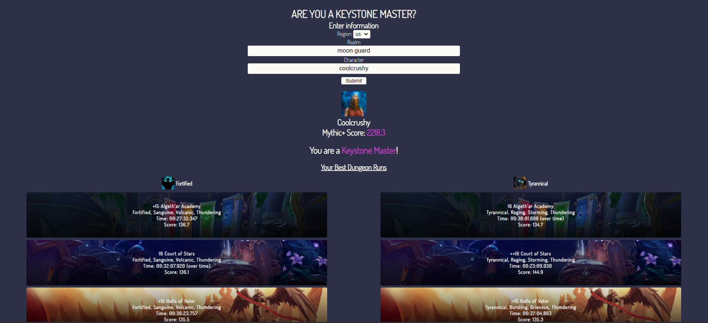
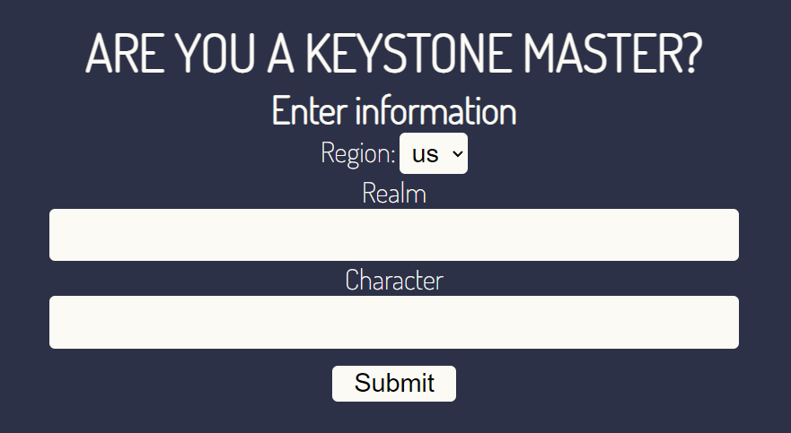
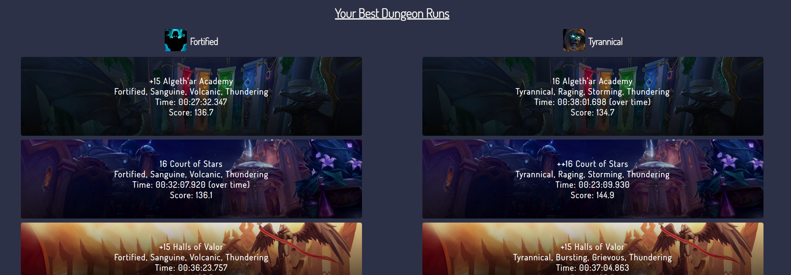
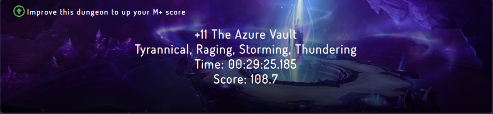
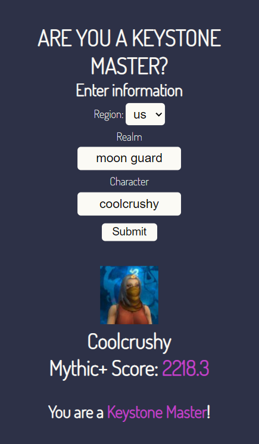
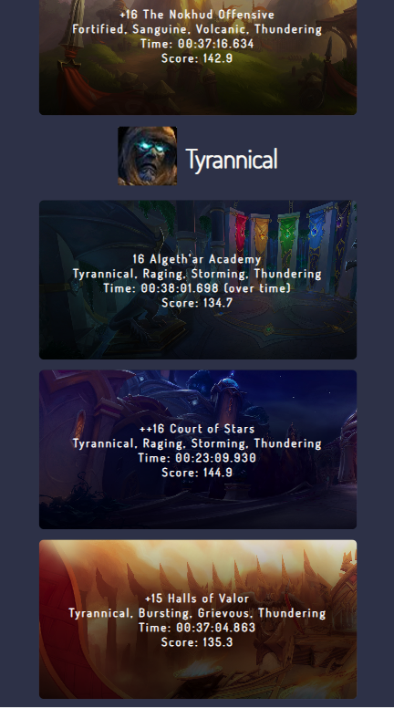

<h1 align="center">Keystone Master Tracker</h1>

  

The Keystone Master Tracker is an application that allows users to input their World of Warcraft character and check their best dungeon runs for Mythic+, informing
them whether their character has attained the Keystone Master achievement.

<h2>Overview</h2>

Use the input fields to enter your character, server, and region.

  

Upon entering your character information, a dropdown of your dungeons will appear. These are your best dungeons completed on both Fortified and Tyrannical weeks. The dropdown will show each dungeon you've completed, the keystone upgrade level, affixes, time completed, and total score. Clicking on a dungeon box will redirect you to the Raider.io page of that dungeon run.

  

If your character has not attained Keystone Master, the UI will indicate which dungeons you can improve. This is shown by the green arrow at the top left of each dungeon box that you can hover over.

  

<h2>Mobile Support</h2>

This app employs mobile-first design and will work on all mobile devices and OS'

  
  

